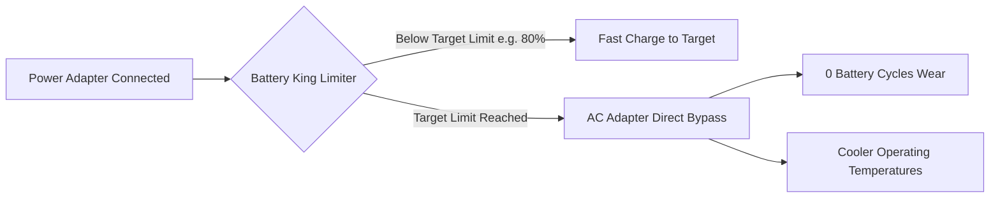

# 👑 Battery King

> **The definitive battery charge limiter and health manager for Apple Silicon MacBooks.**

[-black?style=flat&logo=apple)](https://github.com/vtshreeram/battery)
[](LICENSE)
[-brightgreen.svg)](README.md)
[](https://github.com/vtshreeram/battery/actions)

**Battery King** is a high-performance power management suite engineered specifically for Apple Silicon (M1, M2, M3, M4) MacBooks. It limits charging to 80% (or any custom limit between 50% and 100%), keeping your battery cool and substantially extending lithium-ion cell lifespan when connected to power.

Maintained at **[`vtshreeram/battery`](https://github.com/vtshreeram/battery)**.

---

## 💡 Why Battery King?

Lithium-ion battery cells experience their highest chemical, mechanical, and thermal stress when held at **100% state of charge under continuous high voltage**. 



By maintaining your battery around **70%–80%** when connected to power, Battery King instructs macOS and the Apple System Management Controller (SMC) to power your laptop directly from the AC adapter (Adapter Bypass), preventing micro-cycles and long-term capacity degradation.

---

## ✨ Features

### 🛡️ Smart Charge Limiting
* **AC Adapter Bypass**: Powers the laptop directly from the AC charger once target is reached, saving battery cycle wear.
* **Persistent Daemon**: Maintains target threshold across system reboots, user login, and sleep/wake cycles via a native `LaunchAgent`.
* **Flexible Limits**: Choose quick presets (`70%`, `75%`, `80% (Recommended)`, `85%`, `90%`, `100%`) or configure any custom percentage (50%–100%).
* **Optional Force-Discharge**: Discharges an overcharged battery down to your target limit before initiating AC bypass.

### ✈️ Travel Mode & Quick Actions
* **Travel Mode (Scheduled Departure)**: Set your flight or departure time; Battery King tops off to 100% just in time, minimizing time spent resting at full saturation.
* **Charge to 100% Once**: One-click full charge top-up that automatically restores your protection limit once completed.
* **Temporary Pause**: Pause protection for 1 hour, 4 hours, until tomorrow morning (8:00 AM), or until power is unplugged.
* **Battery Calibration**: Automated 4-stage discharge/charge cycle to recalibrate macOS capacity estimation registers.

### 🎨 Apple Native System Settings Design
* **macOS HIG Compliant**: Built to mirror macOS System Settings (Ventura, Sonoma, Sequoia) with native SF squircle icon badges and inset grouped cards.
* **Live Telemetry**: Real-time 3-second live updating of charging metrics, hardware temperature, and adapter status.
* **Instant Search**: Search bar to dynamically filter preferences tabs.
* **Smart Heuristic Recommendations**: On-device advisory banners for thermal warnings and optimal charging habits.

### 📊 Health Analytics & Statistics
* **Hardware Telemetry**: Displays Maximum Capacity, Cycle Count, Hardware Condition, and Operating Temperature.
* **Observational Trends**: Tracks average, minimum, and maximum operating temperatures across recorded snapshots.
* **Protection Impact**: Measures cumulative hours spent in AC Adapter Bypass (wear prevented / cycles saved).

### 🔒 100% Private & Hardened
* **Zero Telemetry**: Completely devoid of external tracking, analytics endpoints, or remote callbacks.
* **Sandboxed Path Execution**: CLI invocations use strict, sanitized PATH environments.
* **One-Click Self-Repair**: Detects and fixes sudoers permissions, daemons, and lock files automatically.

---

## 📥 Installation

### Requirements
* **Hardware**: Apple Silicon MacBook (M1, M2, M3, M4, or newer). *Intel MacBooks are not supported.*
* **Operating System**: macOS 12 Monterey, macOS 13 Ventura, macOS 14 Sonoma, or macOS 15 Sequoia.

### Option 1: One-Line Terminal Installer (Recommended)
Run the following command in Terminal to install the CLI binary and the menu bar app:

```bash
curl -s https://raw.githubusercontent.com/vtshreeram/battery/main/setup.sh | bash
```

The installer will:
1. Install the Apple Silicon `smc` utility.
2. Install the `battery` CLI binary to `/usr/local/bin`.
3. Configure passwordless `sudo` rights for SMC commands via `/etc/sudoers.d/battery`.
4. Register the background maintenance `LaunchAgent` daemon (`~/Library/LaunchAgents/battery.plist`).
5. Install and launch the **Battery King** application in `/Applications`.

### Option 2: Precompiled DMG Release
Download the latest `battery-1.4.0-mac-arm64.dmg` from the [Releases page](https://github.com/vtshreeram/battery/releases), open it, and drag **Battery King** to `/Applications`.

---

## 🖥️ Command Line Interface (CLI)

Battery King includes a powerful CLI (`battery`) that runs standalone or behind the GUI:

| Command | Description |
|---|---|
| `battery maintain 80` | Maintain battery charge at 80% (reboot-persistent) |
| `battery maintain 80 --force-discharge` | Maintain at 80%, discharging first if currently above 80% |
| `battery maintain 70-80` | Maintain battery within a custom percentage range |
| `battery maintain stop` | Stop maintenance and restore standard macOS charging |
| `battery status` | Display formatted battery, voltage, and SMC charging status |
| `battery status_csv` | Print machine-readable comma-delimited status telemetry |
| `battery health` | Display cycle count, temperature, and maximum capacity |
| `battery calibrate` | Start an automated full calibration cycle |
| `battery charging on\|off` | Directly toggle battery charging via SMC |
| `battery adapter on\|off` | Directly toggle power adapter connection via SMC |
| `battery repair` | Automatically self-repair permissions, visudo, and daemons |

---

## 🛠️ Development & Building

### Prerequisites
* Node.js v20+
* ShellCheck (`brew install shellcheck`)

### Setup & Testing
```bash
# Clone the repository
git clone https://github.com/vtshreeram/battery.git
cd battery

# Validate shell scripts with ShellCheck
shellcheck battery.sh setup.sh update.sh

# Install Electron app dependencies
cd app
npm install

# Run static linter
npm run lint

# Run unit tests (mocked hardware, 0 hardware mutation)
npm test

# Build production macOS arm64 DMG and ZIP releases
npm run build
```

The compiled release packages are generated in [`app/dist/`](file:///Users/vtshreeram/Github/battery/app/dist/):
* `dist/Battery King-1.4.0-mac-arm64.dmg`
* `dist/Battery King-1.4.0-mac-arm64.zip`
* `dist/mac-arm64/Battery King.app`

---

## 📄 License

Battery King is open source software released under the [MIT License](LICENSE).
